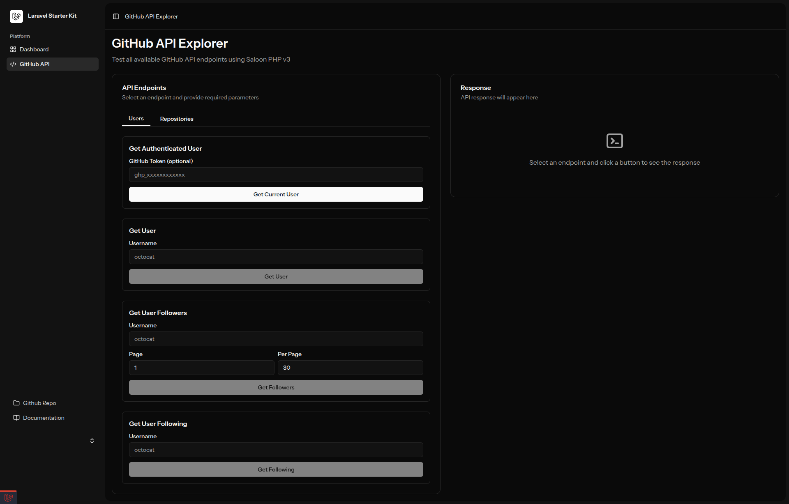

# Nexus API Lab 🚀

A comprehensive demonstration of **SaloonPHP v3** integration with Laravel 12, Inertia.js, and Vue 3. This project showcases how to build clean, maintainable, and testable API integrations using modern PHP best practices.



## ✨ Features

### 🎯 GitHub API Explorer
An interactive web interface to test all GitHub API endpoints with real-time response viewing:

**User Operations:**
- Get Authenticated User - Retrieve current user information
- Get User - Fetch public user data by username
- Get User Followers - List followers with pagination
- Get User Following - List users being followed

**Repository Operations:**
- Get My Repositories - List authenticated user's repos with filters
- Get User Repositories - View public repositories
- Get Repository - Detailed repository information
- Search Repositories - Advanced repository search
- Create Repository - Create new repositories (requires authentication)

### 🔧 Technology Stack

- **Laravel 12** - Modern PHP framework with streamlined architecture
- **SaloonPHP v3** - Elegant API integration library
- **Inertia.js v2** - Modern SPA without the API
- **Vue 3** - Progressive JavaScript framework
- **Tailwind CSS v4** - Utility-first CSS framework
- **Laravel Fortify** - Authentication scaffolding with 2FA support
- **Pest v4** - Elegant testing framework
- **Laravel Sail** - Docker-based development environment

## 🛠 Project Structure

```text
app/Http/
├── Controllers/
│   └── GitHubApiController.php      # API endpoint handlers
└── Integrations/GitHub/
    ├── GitHubConnector.php           # GitHub API connector
    └── Requests/
        ├── Users/
        │   ├── GetAuthenticatedUser.php
        │   ├── GetUser.php
        │   ├── GetUserFollowers.php
        │   └── GetUserFollowing.php
        └── Repositories/
            ├── GetAuthenticatedUserRepositories.php
            ├── GetUserRepositories.php
            ├── GetRepository.php
            ├── SearchRepositories.php
            └── CreateRepository.php

resources/js/
├── pages/
│   ├── GitHubApi/
│   │   └── Index.vue                 # Interactive API explorer
│   ├── Welcome.vue                   # Landing page with feature overview
│   └── Dashboard.vue                 # User dashboard
└── components/ui/                    # Reusable UI components
```

## 🚀 Getting Started

### Prerequisites
- Docker and Docker Compose
- Git

### Installation

1. **Clone the repository**
```bash
git clone <repository-url>
cd saloon-demo
```

2. **Install dependencies**
```bash
vendor/bin/sail up -d
vendor/bin/sail composer install
vendor/bin/sail npm install
```

3. **Set up environment**
```bash
cp .env.example .env
vendor/bin/sail artisan key:generate
```

4. **Run migrations**
```bash
vendor/bin/sail artisan migrate
```

5. **Build frontend assets**
```bash
vendor/bin/sail npm run build
# or for development
vendor/bin/sail npm run dev
```

6. **Open the application**
```bash
vendor/bin/sail open
# or visit http://localhost:8047
```

## 🔑 GitHub API Authentication

To use authenticated endpoints, you'll need a GitHub Personal Access Token:

1. Go to [GitHub Settings → Personal Access Tokens → Fine-grained tokens](https://github.com/settings/personal-access-tokens/new)
2. Create a new token with required permissions:
   - **For reading data:** Repository read permissions, Profile read-only
   - **For creating repos:** Repository admin permissions
3. Copy your token (format: `github_pat_xxxxxxxxxxxxx`)
4. Paste it in the "GitHub Token" field in the API Explorer

## 🎯 Key Saloon Features Demonstrated

### 1. **Connector Architecture**
Clean separation of concerns with a single connector for the GitHub API:
```php
use Saloon\Http\Connector;
use Saloon\Traits\Plugins\AcceptsJson;

class GitHubConnector extends Connector
{
    use AcceptsJson;

    public function resolveBaseUrl(): string
    {
        return 'https://api.github.com';
    }
}
```

### 2. **Request Objects**
Type-safe, reusable request classes:
```php
use Saloon\Enums\Method;
use Saloon\Http\Request;

class GetUser extends Request
{
    protected Method $method = Method::GET;

    public function __construct(protected string $username) {}

    public function resolveEndpoint(): string
    {
        return "/users/{$this->username}";
    }
}
```

### 3. **Authentication**
Built-in token authentication support:
```php
use Saloon\Http\Auth\TokenAuthenticator;

$connector->authenticate(new TokenAuthenticator($token));
```

### 4. **Response Handling**
Simple, elegant response management:
```php
$response = $connector->send(new GetUser('octocat'));

return [
    'success' => $response->successful(),
    'status' => $response->status(),
    'data' => $response->json(),
];
```

## 🧪 Testing

The project includes comprehensive test coverage using Pest v4:

```bash
# Run all tests
vendor/bin/sail artisan test

# Run specific test suite
vendor/bin/sail artisan test --filter=Auth

# Run with coverage
vendor/bin/sail artisan test --coverage
```

**Test Coverage:**
- ✅ Authentication & Authorization (6 tests)
- ✅ Email Verification (6 tests)
- ✅ Password Reset (5 tests)
- ✅ Two-Factor Authentication (6 tests)
- ✅ Profile & Settings (9 tests)
- ✅ Dashboard Access (2 tests)

## 📋 Available Routes

### Web Routes
- `GET /` - Landing page with feature overview
- `GET /github-api` - Interactive GitHub API Explorer
- `GET /dashboard` - User dashboard (authenticated)

### API Routes
- `POST /github-api/users/*` - User-related endpoints
- `POST /github-api/repositories/*` - Repository endpoints

## 🎨 Frontend Features

### Interactive API Explorer
- **Tab-based Interface** - Organized by Users and Repositories
- **Real-time Response Viewer** - Formatted JSON with syntax highlighting
- **Loading States** - Visual feedback during API calls
- **Error Handling** - Clear error messages and status codes
- **Dark Mode Support** - Automatic theme switching
- **Responsive Design** - Works on all devices

### Landing Page
- Feature overview with endpoint descriptions
- Technology stack highlights
- Quick-start CTA buttons
- Authentication requirements badges

## 🔧 Development

### Code Style
```bash
# Format PHP code
vendor/bin/sail bin pint

# Check for style issues (without fixing)
vendor/bin/sail bin pint --test
```

### Generate Wayfinder Routes
```bash
# After adding/modifying routes
vendor/bin/sail artisan wayfinder:generate
```

### Clear Caches
```bash
vendor/bin/sail artisan optimize:clear
```

## 📚 Learning Resources

### SaloonPHP Documentation
- [Official Docs](https://docs.saloon.dev)
- [GitHub Repository](https://github.com/saloonphp/saloon)
- [Upgrade Guide v2 → v3](https://docs.saloon.dev/upgrade/upgrading-from-v2)

### Laravel Ecosystem
- [Laravel 12 Documentation](https://laravel.com/docs/12.x)
- [Inertia.js](https://inertiajs.com)
- [Laravel Fortify](https://laravel.com/docs/12.x/fortify)
- [Pest Testing](https://pestphp.com)

## 🤝 Contributing

This is a demonstration project for learning purposes. Feel free to:
- Fork and experiment
- Add new API integrations
- Improve the UI/UX
- Add more test coverage
- Document your learnings

## 📝 License

This project is open-sourced software licensed under the MIT license.

## 🙏 Acknowledgments

Built with:
- [Laravel](https://laravel.com) - The PHP Framework for Web Artisans
- [SaloonPHP](https://docs.saloon.dev) - Beautiful API Integrations
- [Inertia.js](https://inertiajs.com) - The Modern Monolith
- [Vue 3](https://vuejs.org) - The Progressive JavaScript Framework
- [Tailwind CSS](https://tailwindcss.com) - Rapidly build modern websites

---

**Built by developers, for developers** 💙
